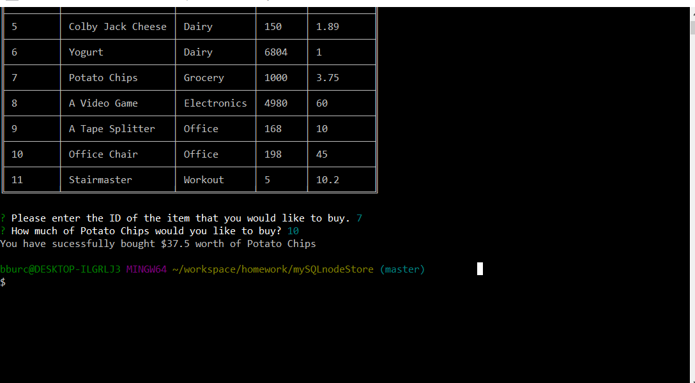
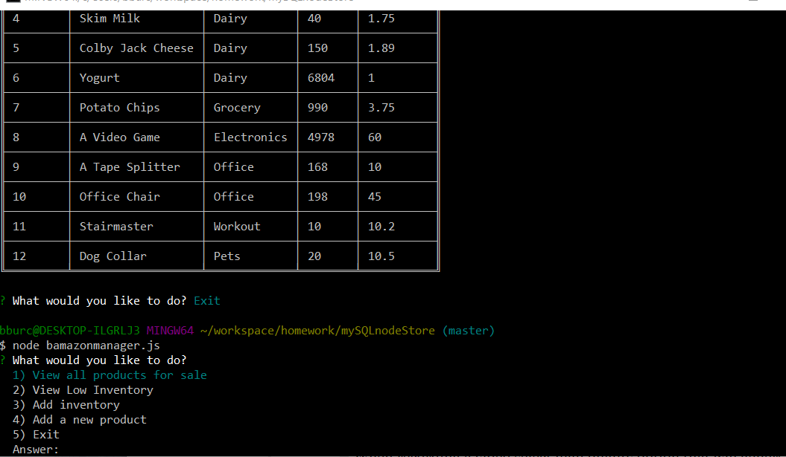

# mySQLStore

The purpose of this project is to mock up a store interface using a mySQL database and manipulate the database through javascript. There are two parts to this project.
[x] bamazoncustomer.js
and
[x] bamazonmanager.js

# bamazoncustomer.js

This is a simple program that mocks a person buying an item from a storefront.

When the program is started the user is greeted with a table containing all items in the mySQL database. 

Afterwards, it prompts the user to pick an item's ID from the table to purchase, and then it will prompt the user to choose the quantity of the item they would like to purchase. The user cannot enter a number higher than the total quantity of that item.

## EXAMPLE : 

# bamazonManager.js

bamazonManager mocks the Manager side of the Store.

There are 4 Main functions of bamazonManager.

## View All Products for Sale
    Displays all products available in a table containing their ID, name, Department, Qty Left and Price.

## View Low Inventory 
    Displays all products with a quantity left of 5 or less.
    If there are none then it informs the user that the store is well stocked.

## Add Inventory
    Prompts the user to select an item that they wish to add inventory to.

    Afterwards prompts them to choose the amount to add.

    Finally it confirms the amount that the user has added and the item's new total.

## Add Product
    Prompts the user to add a new item to the store by asking them to provide the item name, department, total quantity and price of the item. 

    If successful it informs the user that an item has been sucessfully added.

## Example of all functions of this program:

